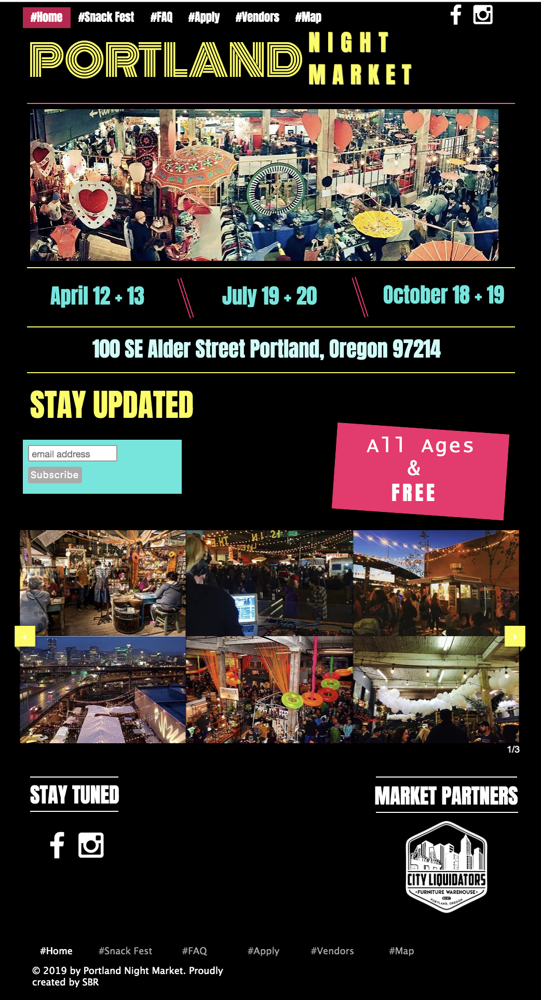

# _Portland Night Market_

#### _Reclone existing Portland Night Market website_

#### By
Victoria Martinez
Dino Nguyen
Issac Hall
Nelia Terrazas
Chris Breaux

## Description

Cloned Portland Night Market to make site cleaner and user friendly.
Followed class exercise:
* Building Environment
* Functional Programing
* Create Components
* Create with Props and propTypes
* Styling with CSS Objects
* Looping in jsx
* Adding and defining routes

## Setup/Installation Requirements

* Cloned git hub https://github.com/vmartinezlive/Farmers-market2.git
* install npm: npm Install
* run program: npm run start
* open local host on the browser of your choice: http://localhost:8080

## Original Site

## Cloned Site

## Known Bugs

There is no known bug.

## Support and contact details

For more information or concerns, contact vmartinez72@live.com.

## Technologies Used

* React
* JSX
* Babel_
* webpack
* CSS
* PropTypes

### License

Copyright (c) 2019 **_Victoria Martinez_**
